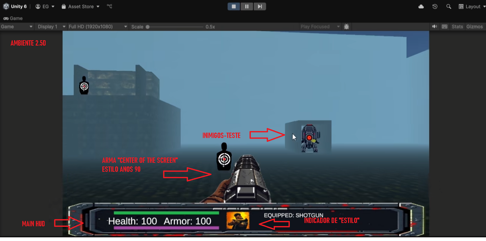
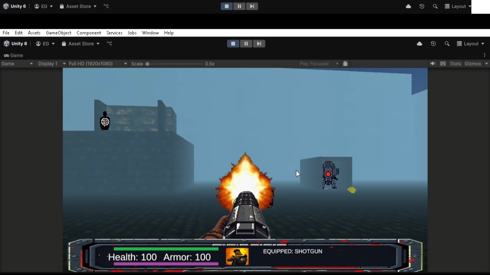

**Outcaster - Game Design Document (Esboço Inicial)**

**1\. Visão Geral do Jogo** - **Nome**: Outcaster - **Gênero**: Boomer Shooter / FPS retrô com influências de character action - **Estilo visual**: Mistura de 2.5D com sprites pixelados e elementos 3D - **Plataforma alvo**: PC - **Engine**: Unity 6  
 

**2\. Ponto de Diferenciação (USP)** - Sistema de “estilos de combate” inspirados em character action games (Yakuza 0, Devil May Cry) - Apenas 4 armas, cada uma tratada como um “estilo de luta” com habilidades e comportamentos únicos - Combinação de combate retrô com ação estilizada e exagerada - Trilha sonora misturando influências de Doom, Devil May Cry, Yakuza 0 e ShootieHG (FF13-2)  

**3\. Mecânicas principais** - Combate em primeira pessoa com auto-aim vertical (estilo Doom clássico) - Troca de estilo/arma em tempo real (teclas 1 a 4 ou botões de atalho) - Cada estilo tem comportamento distinto, incluindo ataques primários, especiais e possibilidade de “combos”

**4\. Sistema de Estilos** Os estilos substituem o sistema clássico de 9 armas do Doom. Cada um representa uma arma que define completamente a maneira como o jogador interage com o combate.

- **Rocket (Estilo Pesado)**
- Tiro com foguetes (projéteis) que causam dano em área
- Pode ser usado como arma corpo a corpo (rocket bat)
- Especial futuro: rocket jump ou ataque explosivo de impacto
- **Shotgun (Estilo Caótico)**
- Tiro hitscan de dano alto e alcance curto
- Especial futuro: “Too Many Shotguns” — cria dezenas de disparos simultâneos absurdos
- **Katana (Estilo Melee/Técnico)**
- Combos corpo a corpo com ritmo e timing
- Especial futuro: dash cortante, counters ou parry
- **Chaingun (Estilo Combo Builder)**
- Alta cadência de tiro
- Pode “encadear combos” com hits consecutivos e multiplicadores

A troca entre estilos é fluida, e o jogador pode criar sequências (combos inter-estilos) usando diferentes armas em cadeia. Isso traz profundidade semelhante aos estilos de luta de Devil May Cry e Yakuza 0.

**5\. HUD e Interface** - Exibição de vida, armadura, munição e estilo/arma atual - Design inspirado nos HUDs de Doom clássico, com elementos pixelados - Futuro: indicador de barra de especial e efeitos de feedback visual para estilo ativo

**6\. Estrutura de jogo (a definir)** - **Opção 1**: Fases com layout fixo e design manual (estilo Doom, Quake) - **Opção 2**: Estrutura roguelike (geracão procedural + upgrades entre salas)

Possibilidade de combinar os dois: fases com layout definido e elementos aleatórios de upgrades e desafios.

**7\. Progressão e Upgrades** - Sistema de upgrades baseado em estilo (por estilo/arma) - Pode ser feito por: - Coleta de recursos durante fases (estilo rogue-lite) - Árvore de habilidades acessada em intermissões entre fases - Powerups fixos em fases lineares - Exemplos de upgrades: combo extra, disparo alternativo, cooldown reduzido, ataques especiais

**8\. Inimigos** - Sentinela estática (implementada): dispara foguetes em direção ao jogador - Futuro: - Inimigos corpo a corpo básicos (“brawlers”) - Inimigos rápidos (“scouts”) - Voadores, tanques, elites que exigem estilos específicos

**9\. Trilha Sonora** - Combina temas eletrônicos pesados com riffs agressivos e groove - Referências diretas: - _Mick Gordon_ (Doom 2016/ETERNAL) - _ShootieHG_ (Final Fantasy XIII-2) - _Yakuza 0_ OST (Batallas, Majima themes) - _Devil May Cry_ series (combate em estilo, intensidade e batida)

**10\. Status atual do protótipo** - HUD funcional (vida, armadura) - Player e sentry podem causar dano entre si - Rocket e shotgun funcionando - Troca de arma - Auto aim vertical implementado

**11\. Próximos passos sugeridos** - Implementar HUD de munição - Adicionar efeito de explosão para foguetes - Criar novo inimigo móvel - Prototipar especial da shotgun (múltiplos tiros) - Criar menu de seleção de estilo e indicador visual - Esboçar sistema de upgrades e HUD de estilo